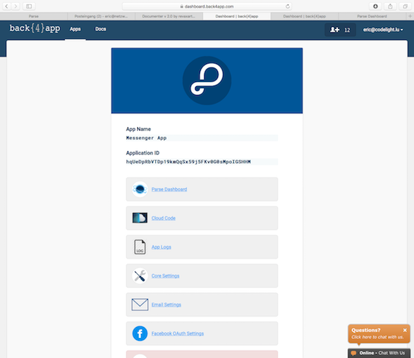
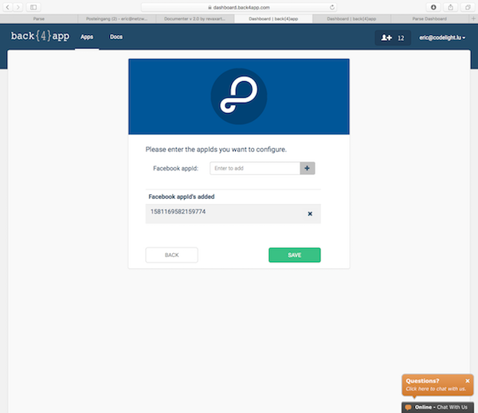
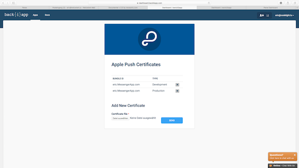
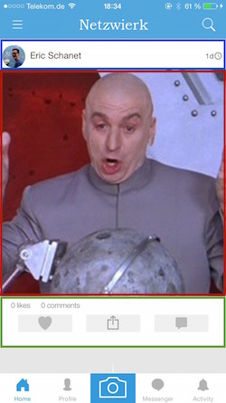
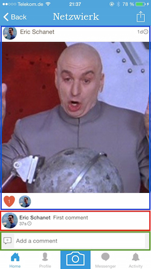
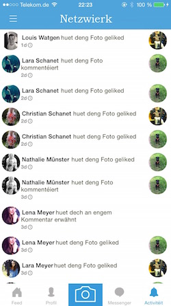

[Social Network](#)

*   [PRELIMINARIES](#preliminaries "PRELIMINARIES")
*   [FIRST STEPS](#first_steps "FIRST STEPS")
*   [CLASSES](#classes "CLASSES")
    *   [LaunchScreen](#classes_launchscreen)
    *   [Login and Signup](#classes_login_and_signup)
    *   [Terms of Service](#classes_terms_of_service)
    *   [Edit and complete the user's profile](#classes_edit_and_complete_the_user_39s_profile)
    *   [HomeViewController and TabbarController](#classes_brhomeviewcontroller_and_tabbarcontroller)
    *   [ESPhotoHeaderView](#classes_bresphotoheaderview)
    *   [ESPhotoFooterView](#classes_bresphotofooterview)
    *   [ESPhotoCell](#classes_bresphotocell)
    *   [ESPhotoDetailsViewController](#classes_esphotodetailsviewcontroller)
    *   [ESPhotoDetailsHeaderView and ESVideoDetailsHeaderView](#classes_esphotodetailsheaderview_and_esvideodetailsheaderview)
    *   [ESPhotoDetailsFooterView](#classes_esphotodetailsfooterview)
    *   [The comments - ESBaseTextCell](#classes_the_comments_esbasetextcell)
    *   [Profile page](#classes_profile_page)
    *   [Taking a photo or video](#classes_taking_a_photo_or_video)
    *   [Messenger](#classes_messenger)
    *   [ESMessageCell](#classes_esmessagecell)
    *   [ESFindFriendsViewController](#classes_esfindfriendsviewcontroller)
    *   [Popular posts](#classes_popular_posts)
    *   [Settings](#classes_settings)
    *   [Logout](#classes_logout)
*   [LOCALIZATION](#localization "LOCALIZATION")
*   [RESKINNING](#reskinning "RESKINNING")
*   [CHECKLIST](#checklist "CHECKLIST")
*   [MIGRATION](#migration "MIGRATION")
*   [DEPENDENCIES](#dependencies "DEPENDENCIES")
*   [LICENSE](#license "LICENSE")

Social Network
==============

Social Network Project Documentation

*   created: 05/20/2015
*   latest update: 03/07/2018
*   by: Eric Schanet

My Social Network project, open sourced. This documentation guides you through the setup and explains, step by step, the basics of the code, so that you can modify and customise it easily.

### PRELIMINARIES

* * *

**NOTE: If you already have a Parse app that you want to migrate over to back4app, then you can simply head over to the migration section.**

This project has been developped during 2014, and is originally a social network for Luxembourg, my home country. It has been published in August 2014 under the name of [Netzwierk](http://www.netzwierk.lu). After a certain number of enhancements and updates, we have decided to make the source code available to other developers, so that they can create their own social network. 

The project uses a custom Parse API (referred to as "API") hosted on [back4app](https://www.back4app.com) as backend - a service that lets you host your data and essentially spares you of the whole server-side programmation, you don't need to write a single line of server-side code (PHP, etc.). This is a huge advantage, because you, as a developer, can completely focus on creating the user interface, without having to think much about data modelling - you send your data to back4app, and they store it for you. Concerning the login, we also make use of the [Facebook SDK](https://developers.facebook.com/docs/ios), because we do not only offer a classic username/password login, but also a Facebook login via Facebook button.

For the Messenger in our social network, we decided to use [Firebase](http://www.firebase.com) alongside with back4app. Roughly, we store the messages on Firebase but the proper chatrooms on back4app. This has some very good reasons, it reduces the latency of the messenger and allows us to integrate read and delivered receipts. 

In the folder you have downloaded are two files called `Documentation.html` and `Documentation.pdf`. These files are a complete documentation of the whole source code, simply double click on the .html file and the documentation should open in your browser. In case the .html documentation doesn't work, use the .pdf documentation (although the layout of the .html version is much better). Nearly every method that is not a delegate method from the iOS or Parse SDK and practically every declared variable is explained in this documentation.

The next sections will guide you through the basic setup, explain you the functional principle of the project and tell you what you have to know about this social network and its dependencies. There are, however, a few things I'd like to mention here, because you need to know them in order to understand the code. The project contains three very important helper classes: the `ESConstants`, the `ESUtility` and the `ESCache` class. 

* The `ESConstants` files contain all the important constants for the whole project. Most of the strings you find there are related to the datamodel we use to store our data. You have to understand that, although our API is messing around with the data for us, we have to store the data efficiently and with a clever system so that we can gather any data we need at any moment and without much effort. Let's look for example at the user class. A  model user has a unique objectId, a username, a mail adress, a password, a display name, a lower version of the display name, maybe a facebookID, etc. You see, there are lots of keys we need to assign to a user - and these keys have unique names. Thus, we define these keys in the `ESConstants` class, avoiding to get lost confused while using them.   
Here is an example, can you guess what we need this key for? 

```objc
NSString *const kESUserDisplayNameKey   = @"displayName";
```

*  The `ESUtility` is, obviously, a utility class where we define public methods that are oftenly used. An example is following a user:

```objc
+ (void)followUserInBackground:(PFUser *)user block:(void (^)(BOOL succeeded, NSError *error))completionBlock;
```

*  The `ESCache` files define methods we use for caching purposes. Our users may not have unlimited data volume or a very stable connection, so we want to minimize the use of internet connection. Therefore, we try to cache every query and check the cache everytime before we use an active internet connection. This reduces also the amount of times the user has to face empty viewcontrollers because we can always display old results from the cache before updating to the new ones. 

One last general notice before we begin - most of the time I denote files and classes by writing their names in italics, for example `ESConstants.m` file. The folder in which these files are lying will be denoted by the following procedure: `SocialNetwork > Supporting Files` folder. What I mean is that the `ESConstants.m` file is in the `Supporting Files` folder which is a subfolder of the `SocialNetwork` folder. Alright? Let's go!

### FIRST STEPS

* * *

Obviously, the first thing to do, is to open the project. You will find the .xcodeproj file in the same folder you found the documentation, double click the file, and XCode should open you the well-known project window. 


Don't be overwhelmed by the number of files in the project, it is a complete social network, so there is a certain number of different classes. Instead, immediately try to run the application for the very first time on your device or on the simulator. It should work without any problems. If you do encounter problems you can't solve on your own, please don't hesitate to contact me. Normally, you shouldn't encounter any problems, and the project should run properly, without having changed anything. In that case, you'll see the app on your device (or simulator) - you can begin to navigate through it, become familiar with it, but we need to change some things before you can really call this social network your own.

We'll start with integrating your own back4app app.   
 

### Back4app Integration

First things first: If you are looking to migrate your existing Parse app over to back4app, please head over to the migration section. If you don't have a Parse App of this project and want to create a back4app app with Parse API, this is the right section for you.

At the moment, you still run the app with my preset database on my back4app account. You need to register yourself at back4app.com, and create a new Parse app (the name is your choice). Once you've done that, you should familiarize yourself a bit with back4app and the open-sourced Parse dashboard (currently empty).



Navigate to the Core Settings section on the left (right under the 'Settings' section). There, you'll have to copy the 'APPLICATION ID' and the 'CLIENT KEY'. In your XCode project again, navigate to the `AppDelegate.m` file which is in the `SocialNetwork` folder in the project navigator. You'll see the 'application:didFinishLaunchingWithOptions' method in the `AppDelegate.m`. In the beginning of the method is mentioned an APPLICATION ID and a CLIENT KEY - exchange these keys with the ones you have copied from your app's settings on back4app.com:

```objc
[Parse initializeWithConfiguration:[ParseClientConfiguration configurationWithBlock:^(id<ParseMutableClientConfiguration> configuration) {
    configuration.applicationId = @"APPLICATION_ID";
    configuration.clientKey = @"CLIENT_KEY";
    configuration.server = @"https://parseapi.back4app.com";
}]];
```

Run the project again, there should be no problem at all (except for the facebook login). To clarify - what you've done now, is giving your project another backend app on back4app, which means that your app now gets its data from another databrowser, your own databrowser (and not the one I have preset) because you want to have control over the data, don't you?

We're nearly done with the back4app.com part, the last thing to do is connect our Parse app with the Facebook login in the project. Therefore, go to the [developers page](https://developers.facebook.com/) of Facebook.

### Facebook Integration

Create a new app on the developers page of Facebook (again, the name is your choice). Once you've done that, you'll be presented with the dashboard view of the Facebook app. In this view copy the APP ID and the APP SECRET keys and, in your XCode project, navigate to the `Info.plist` file, which is in the `SocialNetwork > Supporting Files` folder in the project navigator.


In the `Info.plist` file you have to change three things:

*  the 'FacebookAppID' value should match you APP ID you copied from the Facebook developers page  
*  the 'Facebook Display Name' value should match the display name you chose for your app on the Facebook developers page  
*  in the 'URL Types' key, you'll find an 'Item 0' with an 'URL Schemes' key. In this key, change the value for 'Item 0'  to match your custom url scheme. Normally, this is `fbYOUR_APP_ID`.


Back to the Facebook developers page. Go to the Settings tab of your Facebook app and add a new platform. Choose iOS as platform and enter your bundle ID (per default eric.SocialNetwork, but you should change this to match your own), as well as the URL Scheme you jsut created in the `Info.plist`. Don't forget to save the changes.


Now back to back4app.com. In the Facebook OAuth settings tab of your back4app app, you have to enter your Facebook APP ID and hit save! 



That's it. Run your project again, and try to login with Facebook (only on your physical device). If you've setup your Facebook profile on your device, you'll be asked to grant Facebook some basic permissions and once you've done that, you're ready to go an are signed up to the social network.

We now cope with the remaining Firebase part.  
 

### Firebase Integration

**plist:** As already mentioned, this project uses Firebase to store the actual messages you write another user via the messenger in the app. That means that you need to register yourself at [Firebase.com](http://www.firebase.com) and create a new app/project with your own custom and fancy name. After finishing the registration and creating your own project on Firebase, go to the project's dashboard (if you aren't already there) and simply open the project's settings (the small gear-styled button just beside the `Project Overview` tab). In the settings, add your iOS app to your Firebase project, and subsequently download the GoogleService-Info.plist.

Once downloaded, import that .plist into your XCode project by replacing it with the existing GoogleSerivce-Info.plist. It is important that you replace it with the existing plist, and it is also important that you replace it with the existing GoogleService-Info.plist and not the info.plist of the project itself.

**authentication:** Another thing you need to do is enabling email/password authentication. To do that, you open up the 'Develop' tab on the left side of the dashboard, and select 'Authentication'. On the page that opens, select the 'Authentication methods' tab and enable email/password authentication.

Run your app again, and send some test messages to any user. You should see them in your databrowser on Firebase.com. This is where your messages will be saved.

The last part to do, is messing around with the Push Notifications. That's what we'll do in the following steps.

### Push Notifications

As the push notifications are sent with our custom version of the open sourced Parse API, head over to Parse's [Quick Guide for iOS Push Notifications](https://parse.com/tutorials/ios-push-notifications), which guides you through the (a bit complicated) setup. Basically, you have to generate some signing certificates and enable Push Services in your iOS Dev Center from Apple. This is the moment to choose your app's Bundle ID and replace the old 'eric.SocialNetwork' Bundle ID in the `Info.plist` file with your new one, if you haven't done it already (you should, because changing it now will affect your Facebook login, and you'll have to update the Bundle ID also on Facebook's developer page). You can now also change the 'Bundle Display Name' in the `Info.plist` to match your own cool app name. At the end of Parse's push tutorial, you should have a .p12 file, which you can upload to back4app.com



Once you're done with setting up the pushes, run your app again (ideally on two different physical devices, with two different users), and send a message from one user to anothere - you'll see that the pushes will arrive on the respective devices, if you've done the setup correctly.

Again, if you have any problems, questions or suggestions, please don't hesitate to contact me. 

### Cloud Code

This project comes already with the cloud code files. Everything you need to do, is upload the javascript files to your app. You can do this from inside your cloud code settings of your back4app app. You can also refer to [this](http://blog.back4app.com/2016/03/21/how-to-use-parse-cloud-code-on-back4app/) tutorial by back4app.

Now to the .js files themselves. 

The `Activity.js` file contains code that is called once a new activity is created in the parse databrowser. This is the place where we send the cloud push notifications (heureka).   
The `Installation.js` file contains code that is called when a new device is registered at Parse. This file doesn't do anything really interesting, it only ensures all installation are accurate and not falsified.   
The `MasterKeyFunctions.js` file currently doesn't contain any code, but it is the place where you would place functions that require the master key. This is necessary when you want, for example, to resort your databrowser and don't want to do it manually.  
The `photo.js` file contains code that is called once a new photo or video is uploaded. It ensures no errors occur during the upload.   
The `main.js` file is the main file where all the other files have to be imported in order for them to be really considered by the CloudCode compiler of back4app.

### CLASSES

* * *

If you have no experience in iOS programmation at all (or even worse, no experience in programmation at all), it will be really hard for you to really understand the whole source code, or be able to do deep changes to it. 

What I can do to help you understand a bit where what lies, and which classes are responsible for which behavior and ViewController. One thing beforehand: most of the classes have quite straightforward names, so that you immediately know what they do.  
Another general thing to mention is that the code is not written to be condensed at a maximum. If you have some experience in development in Objective-C, you will sometimes think that there may be ways to implement certain functions in a shorter and cleaner way. The main problem is that condensed and short code often comes with one great disadvantage: its readibility decreases rapidly, and this is a great disadvantage when it comes to unexperienced developers looking at a code. You could argue that these developers then do not get the right notion of clean code, this is certainly true, but in this case clean code doesn't help them if it comes to bug fixing, maintenance and customisation. If you want to learn something about clean code, consider specialised literature, there are some really good books out there.

Thus, I often chose readability and straightforwardness over complex and condensed code. Apart from this, there are also parts of the code where I simply was not in the mood to completely rewrite them in order to get real clean code. For example, I often talk about photos, even if there are also videos - you should **always** keep in mind, that the videos have been added on a later update to this project, so initially there were only photos, explaining why the term _photo_ often refers to photos and videos, a general mediaItem (if this suits you better). May Sauron forgive me...

That said, let's go and start to orientate us in a more than 1.200.000 code-lines long project. I will give you several screenshots and code snippets of the app and explain where you will find the different classes and what the most important things about them are.  
 

#### LaunchScreen

We'll start with the Launch Screen because it is the very first screen you see of the app. 

Customising this one is really easy, because it is an .xib file, the `LaunchScreen.xib` which you find in the `SocialNetwork > Supporting Files` folder in the project navigator of XCode. Currently it shows the name of our luxembourgish social network, the link to the website and a fancy quote by the famous physicist Richard Feynman. I am a physicist, so this is legit (ha ha).  
 

#### Login and Signup

The next thing we look at is the LoginViewController and the SignupViewController. The respective classes are the `ESLoginViewController.h/.m` and the `ESSignupViewController.h/.m`, which you'll find in the `SocialNetwork > Controllers > Login` folder the project navigator. They both have .xib files, but the main layout is done in the tableview delegate and data source methods

You'll notice that the Login folder contains another class - the `WelcomeViewController` class. This one decides at runtime if a user is logged in, and the feed shall be shown or if there is no valid user session and the `ESWelcomeViewController` shall be shown. It is in face a ViewController where the user is presented with a short introduction of the project and can decide whether or not he wants to login or signup.

The fourth class in this folder is the `ESPageViewController`, the actual PageViewController that is displayed in the `WelcomeViewController`. The data source is defined in the `WelcomeViewController`, but if you want to change something about the design, better do it in the `ESPageViewController` class.

#### Terms of Service

The first time a user logs in and enters the network, we show him classic UIAlertView prompting him to accept our terms of use.

You'll also have to change the Terms of Service to your own. Currently, they are shown by a link, that takes the user to the mobile safari app, and shows the Terms of Service that are displayed on our website. If you have no website to display the terms, you can save them as a .pdf an show the .pdf to the user instead of taking him to the external link. If you choose to adopt our terms, be sure to have read them at least [ ;-) ]. In case you want to change the link to your own custom terms, you have to do it at two places: one instance is in the `AppDelegate.m` file, the other in the `ESHomeViewController.m` file, both times in the delegate method of the UIAlertView.

[[UIApplication sharedApplication] openURL:[NSURL URLWithString:@"https://www.netzwierk.lu/terms"]];  
 

#### Edit and complete the user's profile

The next view that will be presented to the user at his first login, is a view, where he will be prompted to complete his profile information. You'll notice, that lots of users don't even set a profile picture if you don't remind them at least once. Therefore, I created this view, its class is the `ESEditProfileViewController.m` that you find in `SocialNetwork > Controllers > Settings`.   
You can add new fields and remove some of them, or change everything you'd like. This class handles all of its methods on its own, so no utility or wrapper class needed. It is a simple tableviewcontroller - you set your desired number of sections and number of cells per section:

```objc
- (NSInteger)numberOfSectionsInTableView:(UITableView *)tableView {
    return 4;
}

- (NSInteger)tableView:(UITableView *)tableView numberOfRowsInSection:(NSInteger)section {
    switch (section) {
        case 0:
            return 3;
            break;
        case 1:
            return 2;
            break;
        case 2:
            return 3;
            break;
        case 3:
            return 3;
            break;
        default:
            return 0;
    };
}
```
  
And then you design the cells and simply define actions that are performed when the respective cells are tapped. No magic at all here.   
Note that the user can only then continue to the app if he changes at least one field. This prevents the user from tapping that view away without completing at least some of its information.

####   
HomeViewController and TabbarController

Once the user has completed his information, he will be guided to the News Feed ViewController.

The class responsible for this view is the `ESHomeViewController.m` that can be found in `SocialNetwork > Controllers > Home`. The `ESHomeViewController` is one of four controllers in the TabbarController. Most of the actions of the social network happen in that tabbar controller, only a few will take the user to a separate UINavigationController on top of the TabbarController. 

Note that the `ESHomeViewController` is a subclass of the `ESPhotoTimelineViewController` class (you can see that in the the `ESHomeViewController.h` file):

@interface ESHomeViewController : ESPhotoTimelineViewController <EAIntroDelegate, MFMailComposeViewControllerDelegate>

Thus the `ESHomeViewController` contains all the methods of the `ESPhotoTimelineViewController`, esp. the ones that are responsible for the timeline, the feed, itself. The `ESHomeViewController` class handles some methods that are specific for the HomeViewController (the one with the feed), such as an Easter Egg, a mail composer, etc. The behavior of the timeline is defined in the `ESPhotoTimelineViewController` file, so if you want to change some things in the timeline, do it there. In case you head to the `ESPhotoTimelineViewController.m` file, you'll notice that there are other classes with a quite similar name: 



*  `ESPhotoTimelineAccountViewController.h/.m`: this class is responsible for the timeline on the profile page.  
*  `ESHashtagTimelineViewController.h/.m`: this class is responsible for the timeline that is displayed when the user searches for a specific hashtag.  
There was a need to split these classes in different ones because of the fact that the behavior of them is slightly different, despite them doing practically the same thing - displaying a timeline full of photos and videos.

There is, however, one thing they have in common: their layout structure. Look for a example at the HomeViewController and its feed - you'll see that it is essentially built of individual sections. Each sections contains a header, the `ESPhotoHeaderView` (on the screenshot marked blue) and a footer, the `ESPhotoFooterView` (on the screenshot marked green) (we don't differentiate here between video and photo, the headers and footers have the same behavior, so no need to split them up) and a `ESPhotoCell` between the header and the footer (marked red), containing the photo or the video. The `ESPhotoHeader-` and `ESPhotoFooterView` can be found in the `SocialNetwork > Categories > View > TimelineView` folder.

Another thing important to mention is the procedure triggered when the user hits the middle button in the tabbarcontroller - the photo button. He is then presented with a UIActionView prompting him to choose one of three options: taking a new photo or choosing a photo or a video from the camera roll. The methods triggered when the user makes his choice are in the `ESTabbarController.m` file:

```objc
- (BOOL)shouldStartCameraController 
- (BOOL)shouldStartPhotoLibraryPickerController 
```

If you have a more precise look at these methods, you'll see that the lines responsible for pushing a new viewcontroller run in a `dispatch_async` block:

```objc
dispatch_async(dispatch_get_main_queue(), ^{
    [self presentViewController:cameraUI animated:YES completion:nil];
});
```

This is to avoid that, in case the user uses an iPad, no viewcontroller is presented (see [this Stackoverflow thread](http://stackoverflow.com/questions/24854802/presenting-a-view-controller-modally-from-an-action-sheets-delegate-in-ios8)). Throughout the whole project, you should notice that this approach is used quite oftenly. Simply keep in mind that UIKit updates need to be done on the main thread. 

**Important:** There is one thing you should never forget. The timelines always show a certain number of photos/videos, defined in the initWithStyle method:
```objc
self.objectsPerPage = 10;
```
  
And once the user scrolls to the end of the current number of sections, there will be a LoadMoreCell (an instance of the `ESLoadMoreCell` class). Now, since we use Parse's PFQueryTableViewController the delegate method with which we fetch a new page of results (thus a new page of photos and videos) is provided by the Parse SDK, meaning that we have no direct access to it. Unfortunately, after the version 1.2.19 of the SDK, Parse changed its implementation of that method, causing a crash when a section based tableview tries to fetch a new page of results. I have filed a bug report, and many other developers too, but currently, there still is no fix to that bug. Although I managed to find a workaround, remember to always be careful before updating to a newer Parse SDK because the workaround could potentially break down.  
If you mind, please file a bug report, so that this bug gets fixed as soon as possible.

####   
ESPhotoHeaderView

The ESPhotoHeaderView class is, as already said, responsible for the header above the photo in a timeline. It sets the layout for the photo an the name of the photo's user, as well as its location and a timeinterval. Thus, if you want to change the design of the header, do this here.  
But the class cannot get information on its own the name and the user  photo are empty, so it needs another class to give that information about the user. This happens in the `ESPhotoTimelineViewController` (or whatever timeline you consider: hasthag, home or profile) - more precisely in the following method:

```objc
- (UIView *)tableView:(UITableView *)tableView viewForHeaderInSection:(NSInteger)section 
```

which should seem obvious, because we talk about a custom UITableViewSection (the `ESPhotoHeaderView`).

There is another method important for the behavior of the header of a section:  
 
```objc
- (void)photoHeaderView:(ESPhotoHeaderView *)photoHeaderView didTapUserButton:(UIButton *)button user:(PFUser *)user { ... }
```

This method is being called when a user taps on the name or the photo of another user in a timeline.

####   
ESPhotoFooterView

Same procedure goes for the ESPhotoFooterView class. It sets the layout for the like, share and comment buttons (thus changements in the design should be done here), but the actual logic behind these buttons is, again, implemented in the respective TimelineViewController: 

```objc
- (UIView *)tableView:(UITableView *)tableView viewForFooterInSection:(NSInteger)section 

- (void)photoFooterView:(ESPhotoFooterView *)photoFooterView didTapSharePhotoButton:(UIButton *)button  photo:(PFObject *)photo 

- (void)photoFooterView:(ESPhotoFooterView *)photoFooterView didTapCommentOnPhotoButton:(UIButton *)button  photo:(PFObject *)photo 

- (void)photoFooterView:(ESPhotoFooterView *)photoFooterView didTapLikePhotoButton:(UIButton *)button photo:(PFObject *)photo 
```

I think it is more than obvious what these methods do, therefore you should have a look at them in the code. 

####   
ESPhotoCell

The ESPhotoCell is the actual cell betwen the header and the footer in the tableviews (timelines). It is a custom class, apparently, because it has to fit our special needs. You can find this class in the `SocialNetwork > Categories > View > UITableViewCells` folder. Again, in the ESPhotoCell class, we define the layout of the cell, because we want to display a photo in it. The actual photo is added to the cell in the `ESPhotoTimelineViewController` (or whatever timeline you consider: hasthag, home or profile):

```objc
- (UITableViewCell *)tableView:(UITableView *)tableView cellForRowAtIndexPath:(NSIndexPath *)indexPath object:(PFObject *)object 
```
  
And then there are some other important methods:  
 
```objc
- (UITableViewCell *)tableView:(UITableView *)tableView cellForRowAtIndexPath:(NSIndexPath *)indexPath object:(PFObject *)object 

- (void)didTapOnPhotoAction:(UIButton *)sender 
```
The first method here is actually the delegate method from the tableview, d and calling the second one, which then takes the user to a detail view of the photo, where also the comments are shown.  
 

#### ESPhotoDetailsViewController



Once a user taps on a photo or a video, he is taken to a new tableviewcontroller, showing the photo/video as well as the likes and comments. Depending on the nature of the media object (photo or video), the behavior of the tableviewcontroller is defined by the `ESPhotoDetailsViewController` or the `ESVideoDetailViewController` class. Both classes are subclasses of the PFQueryTableViewController class from Parse. The basic structure of the tableviewcontroller is quite easy to guess: It's a simple tableview with a tableviewheader `ESPhotoDetailsHeaderView` (marked blue) with the photo/video being part of the header, a tableviewfooter ESPhotoDetailsFooterView (marked in green) and some custom `ESBaseTextCells` (marked in red) in between.

On launch in 2014, we only had integrated photos. Videos came some weeks later, this is why I have split the `ESPhotoDetailsViewController` and the `ESVideoDetailViewController` classes - they have some own classes they don't share, but other classes they share:

**Not sharing:** `ESPhotoDetailsHeaderView` and `ESVideoDetailsHeaderView` 
**Sharing:** `ESPhotoDetailsFooterView` and `ESBaseTextCell` (because here the behavior doesn't diverge for the resp. class).   
 

#### ESPhotoDetailsHeaderView and ESVideoDetailsHeaderView

These two classes are custom classes of a tableview header. They display the user's profile picture, his name, as well as the location of the photo/video (if there is one) and the time interval since its upload. As with the `ESPhotoHeaderView` class, tapping on the user's name or profile photo takes you to his profile page.  
But additionally to this, these headers also contain the photo/video itself, as well as the likes.Tapping the like button calls a method in the `ESPhoto-/ESVideoDetailsHeaderView` class:

```objc
- (void)didTapLikePhotoButtonAction:(UIButton *)button 
```
  
Most of the view's layout is determined in the following method:  
 
```objc
- (void)createView 
```

#### ESPhotoDetailsFooterView

The `ESPhotoDetailsFooterView` is a UIView subclass, and we use it as a tableview footer in the Photo and Video DetailViewController. Its role is to display a UITextField in which the user can type his comment to a photo or video, and we display it at the very end of the tableview in the Photo-/VideoDetailsViewController with:

```objc
ESPhotoDetailsFooterView *footerView = [[ESPhotoDetailsFooterView alloc] initWithFrame:[ESPhotoDetailsFooterView rectForView]];
commentTextField = footerView.commentField;
commentTextField.delegate = self;
self.tableView.tableFooterView = footerView;
```

As soon as the user hits the return key on his keyboard, the following delegate method is called from within the Photo-/VideoDetailsViewController:

```objc
- (BOOL)textFieldShouldReturn:(UITextField *)textField 
```

In this method, we search for hashtags, mentions, links, etc., edit the comment a bit (trim it, if the user has entered unnecessary space behind it for example) and save it on our database.

#### The comments - ESBaseTextCell

Between the header (the user's profile photo and name as well as the like button and the actual photo/video file) and the footer (the comment textfield) are the existing comments. These are custom UITableViewCells (the `ESBaseTextCell,` we'll face this class several times) as you can see in this TableView delegate method in the `ESPhoto-/ESVideoDetailView.m` file:

```objc
- (UITableViewCell *)tableView:(UITableView *)tableView cellForRowAtIndexPath:(NSIndexPath *)indexPath object:(PFObject *)object {
    static NSString *cellID = @"CommentCell";
    ESBaseTextCell *cell = [tableView dequeueReusableCellWithIdentifier:cellID];
    [...]
}
```

The `ESBaseTextCell` has a profile picture view, a name label, a contentTextLabel and a date label as well as a reply label that can be set dynamically (for example in case the user is the current user - we don't want to reply ourselves do we? Or when we simply don't need the reply function because the ESBaseTextCell doesn't act as comment cell - we'll see this case later).

The user can delete his own comments, or report other users' comments for infringing the terms of service with this method:

```objc
- (NSArray *)tableView:(UITableView *)tableView editActionsForRowAtIndexPath:(NSIndexPath *)indexPath {
    PFObject *object = [self.objects objectAtIndex:indexPath.row];
    
    if ([[[object objectForKey:@"fromUser"] objectId] isEqualToString:[[PFUser currentUser] objectId]]) {
        UITableViewRowAction *deleteAction = [UITableViewRowAction rowActionWithStyle:UITableViewRowActionStyleDefault title:NSLocalizedString(@"Delete", nil) handler:^(UITableViewRowAction *action, NSIndexPath *indexPath) {
            UIActionSheet *actionSheet = [[UIActionSheet alloc]initWithTitle:NSLocalizedString(@"Do you really want to delete this comment?", nil) delegate:self cancelButtonTitle:NSLocalizedString(@"Cancel", nil) destructiveButtonTitle:NSLocalizedString(@"Delete", nil) otherButtonTitles: nil];
            [actionSheet showInView:self.view];
            actionSheet.tag = DeleteCommentTag;
            savedIndexPath = indexPath;    
        }];
        
        deleteAction.backgroundColor = [UIColor redColor];
        return @[deleteAction]; 
    } else {
        UITableViewRowAction *reportAction = [UITableViewRowAction rowActionWithStyle:UITableViewRowActionStyleDefault title:NSLocalizedString(@"Report User", nil) handler:^(UITableViewRowAction *action, NSIndexPath *indexPath) {
            UIActionSheet *actionSheet = [[UIActionSheet alloc]initWithTitle:NSLocalizedString(@"Do you really want to report this user?", nil) delegate:self cancelButtonTitle:NSLocalizedString(@"Cancel", nil) destructiveButtonTitle:NSLocalizedString(@"Report", nil) otherButtonTitles: nil];
            [actionSheet showInView:self.view];
             actionSheet.tag = ReportUserCommentTag;
            savedIndexPath = indexPath;
        }];

        reportAction.backgroundColor = [UIColor redColor];
        return @[reportAction];
    }   
}
```

#### Profile page

We now jump to the second tab of the tabbar controller - it is the profile page of the logged-in user. Its structure is, again, quite easy to grasp: we have a UITableView with different sections (the photos and videos) and a custom tableview header that displays some personal information of the user. The newsfeed you see on the profile page is the `ESTimelineAccountViewController` which is essentially the same class as the `ESPhotoTimelineViewController` except for one important thing: it only displays the user's personal photos and videos. For the rest, it essentially works like the ESPhotoTimelineViewController.

The `ESAccountViewController` class is a subclass of the `ESTimelineAccountViewController`, meaning that it inherits all the methods from it, just like the `ESHomeViewController` inherits from the `ESTimelineAccountViewController`. There should be nothing more to say here, because the structure of the timeline has already been discussed. There are however new things here that have not yet been explained - the actual header containing the user information. Most of its setup is in the following method in the `ESAccountViewController.m` file:
```objc
- (void) setupHeader 
```
In short, the whole header displays following things:

*  Name of the user

*  mention name of the user (usually `@username_of_the_user`)

*  a short bio 

*  the home town/city of the user

*  a website/link that the user has provided

*  the number of photos/videos the user has posted, as well as the approximate number of followers and followed users

*  an `Edit Profile` Button, taking the user to the `ESEditProfileViewController` we have already seen at the very beginning or a `Follow/Unfollow` button when we visit the profile of another user

*  a header photo an a profile photo that the user can set in the `ESEditProfileViewController`

The profile header view is really easy to customise, simply study the `setupHeader` method above and fulfill the changes you want. 

There are, however, two cool things absolutely worthy to say about the profile page. The first one is that the user can set a custom colour to the navigation bar, that applies to everyone visiting your profile page. The secont one is a smooth animation to the header picture as one tries to refresh the profile page. 

#### Taking a photo or video

Once a user presses on the middle camera button in the tabbar, a UIActionView prompts him to choose wether to take a new photo or video or to choose one of the camera roll. If the user decides to take a photo, he will be presented a UIImagePickerController and once he has taken the photo, the controller crops the image to the size 1:1. On the other hand, if the user decides to take a new video, he will be presented a custom video recorder controller, the `RecorderController`. The `RecorderController` uses the `KZCameraView` class and allows the user to take a stop-and-go video: a recording style that is widely used in the well-known Vines. It also allows to change the camera during the video or delete the last recorded part of the video. 

After taking a video, it is automatically uploaded once the user hits the `Done` button. However, the photos are not automatically uploaded - the user is guided to a new videocontroller where he can customise his photo by applying filters and effects on it. This gorgeous controller is provided by the [`CLImageEditor`](http://github.com/yackle/CLImageEditor) a powerful project on GitHub. We call the editor controller from the `ESTabbarController`:

```objc
- (void)imagePickerController:(UIImagePickerController *)picker didFinishPickingMediaWithInfo:(NSDictionary *)info {
    [self dismissViewControllerAnimated:NO completion:nil];

    UIImage *image = [info objectForKey:UIImagePickerControllerEditedImage];
    CLImageEditor *editor = [[CLImageEditor alloc] initWithImage:image];
    
    editor.delegate = self;

    [[CLImageEditorTheme theme] setBackgroundColor:[UIColor blackColor]];
    [[CLImageEditorTheme theme] setToolbarColor:[[UIColor blackColor] colorWithAlphaComponent:0.8]];
    [[CLImageEditorTheme theme] setToolbarTextColor:[UIColor whiteColor]];
    [[CLImageEditorTheme theme] setToolIconColor:@"white"];

    [self presentViewController:editor animated:YES completion:nil];
}
```

Check it out, you'll be stunned how customisable the photos now are because the large variety of filters and effects in this controller. Once the user hits the `Done` button, he is taken to a new viewcontroller where he can add a comment below his photo. This `ESEditPhotoViewController` shows the photo in a photoImageView:

```objc
photoImageView = [[UIImageView alloc] initWithFrame:CGRectMake(0.0f, 0.0f,[UIScreen mainScreen].bounds.size.width, [UIScreen mainScreen].bounds.size.width)];
```

And lets the user enter a comment in the `ESPhotoDetailsFooterView` we've already seen:

```objc
ESPhotoDetailsFooterView *footerView = [[ESPhotoDetailsFooterView alloc] initWithFrame:footerRect];
self.commentTextField = footerView.commentField;
self.commentTextField.delegate = self;
[self.scrollView addSubview:footerView];
```

As you may have already noticed, this controller is not a subclass of the UITableView but a subclass of the UIViewController, thus we don't use any cells but a scrollview with subviews here. After hitting the `Publish` button, the photo is published and all the followers can see it.

#### Messenger

Some information beforehand: the messenger of this social network project is based on the [JSQMessagesViewController](http://github.com/jessesquires/JSQMessagesViewController) framework by Jesse Squires. It's a fantastic project! You should head over to github and have a look at it. However, Jesse Squires did not design his project to work specifically with Parse.com. Yet, we need this particular behavior, and therefore some of the Messenger in this app is also based on modified parts of [NotificationChat](https://github.com/relatedcode/NotificationChat) by RelatedCode (esp. the idea with Firebase is originated from this project - it's a great idea!). Again, you should head over to github to have a look at this fantastic project. 

If you tap on the fourth button of the tabbarcontroller (the one behing the camera button), the in-app messenger opens. The viewcontroller you now see is the ESConversationViewController. It shows all the active conversations you have, either private ones or groups. The way it does this, is by a UITableViewController and custom tableview cells, the `ESMessageCell`.

#### ESMessageCell

The ESMessageCell is a custom tableview class displaying the name of the user, the last message that has been sent as well as a date when the message has been sent an a small label indicating if the message has been delivered and read. Additionally, it shows the profile picture of the user that last sent a message, and if there are unread messages, a blue badge in the upper right corner of the profile picture indicating how many messages haven't been read yet. 

The ESMessageCell is one of the only classes featuring a .xib file, so customising this one is really easy, even for someone with little to no experience in programming. Initially, there is no active conversation with someone - so you have to tap on the right button in the navigation bar, and select someone to chat with. If you want to select someone of your phone contacts, the app presents you the `ESPhoneContacts` viewcontroller, a simple UITableView displaying all of your contacts. You can now select the registered users or send an invitation SMS/mail to someone who isn't yet registered. 

If you, however, want to choose or search for an existing user in the user database, the app presents you the `ESSelectRecipientsViewController` where you can select one or multiple recipients and search for specific usernames. 

Once you select your recipients (group or private chat), a new viewcontroller appears. It's the `ESMessengerView` viewcontroller, a subclass of the `JSQMessagesViewController.` This viewcontroller supports normal text messages, as well as photo, video and audio messages and handles all the send and save methods when a user writes a message:

```objc
- (void)sendMessage:(NSString *)text withPicture:(UIImage *)picture withVideo:(NSURL *)video andWithAudio:(NSString *)audio 

- (void)eventuallySaveMessage:(NSMutableDictionary *)messengerItem 
```

The methods send the message to the other user by updating the last sent message in the resp. conversation in the back4app database and eventually save the message in the Firebase database. The Firsebase database gives us even the possibility to include read and delivered notifications, as well as a typing indicator when the other user is typing a new message. The `ESMessengerView` also supports blocking a user:
```objc
- (void)userBlockAction
```
There are, however, actions that are performed in the background by the `ESUtility` class. One of those is sending a push notification from within the code. As mentioned in the beginning, sending a message triggers a parse push notification that is being sent to the other user(s). The responsible method is the following one:
```objc
+ (void)deliverPushTo:(NSString *)groupId withText:(NSString *)text;
```
As you can see, it is a public method other classes can access. We trigger this method in the `eventuallySaveMessage:` method:
```objc
[ESUtility deliverPushTo:groupId withText:[messengerItem objectForKey:@"text"]];
```
Another thing we do in the background is resetting the badge in the ESConversationViewController indicating how many messages haven't been read and call it from within our `ESMessengerView`:
```objc
+ (void)resetUnreadMessagesCounterFor:(NSString *)groupId withCounter:(NSInteger)amount andLastMessage:(NSString *)lastMessage;
```
```objc
[ESUtility resetUnreadMessagesCounterFor:groupId withCounter:1 andLastMessage:[messengerItem objectForKey:@"text"]];
```
If you want to customise the actual design of the message bubbles, you better consider the documentation of the [JSQMessagesViewController](http://github.com/jessesquires/JSQMessagesViewController). The only thing that is really trivial is changing the color of the bubbles and limiting the length of a video. The respective constants can be found in the `ESConstants.m` file:

```objc
#define MESSAGE_OUT_COLOUR          HEXCOLOR(0x007AFFFF)
#define MESSAGE_IN_COLOUR           HEXCOLOR(0xE6E5EAFF)
#define VIDEO_LENGTH                5
```

###   
ActivityFeedViewController



We've now arrived at the last tabbar controller - the `ESActivityFeedViewController`. In this viewcontroller are listed all the activities related to the logged-in user. In short, it's similar to the notifications you know for example from facebook: when a user likes or comments one of your photos, follows you or mentions you in a comment, you get a notification and a new acitivity appears in the `ESActivityFeedViewController`. The nature of the controller is a simple uitableview, with custom cells, the `ESActivityCell` a subclass of the `ESBaseTextCell` (there it is again). This time, we don't show the replyButton, but display a text indicating the nature of the activity. The exact text is determined in the following method in the `ESActivityFeedViewController:`

```objc
+ (NSString *)stringForActivityType:(NSString *)activityType 
```

There are two other methods that are quite important in this viewcontroller:  
 
```objc
- (void)cell:(ESActivityCell *)cellView didTapActivityButton:(PFObject *)activity 

- (void)cell:(ESBaseTextCell *)cellView didTapUserButton:(PFUser *)user 
```

The first one is a delegate method of the ESActivityCell, triggered when the cell is selected - we then open the photo, video or profile page of the user that is underlying the activity. The second one is a delegate method of the ESBaseTextCell and triggered when a username is selected.

### The SideViewController

Since we've covered now all the controllers within the tabbarcontroller, we can head to the resting controllers and classes. Let's start with the controller, appearing when swiping the whole screen to the right - the `SideViewController`. It's a normal UIViewController, but you is it possible to trigger this custom behavior? The answer is quite simple, we used a MFSideMenuContainerViewController in the `AppDelegate.h:`
```objc
@property (strong, nonatomic) MFSideMenuContainerViewController *container;
```
In the `AppDelegate.m` we then assign a leftViewController and a centerViewController to it:
```objc
self.container = [MFSideMenuContainerViewController containerWithCenterViewController:self.tabBarController leftMenuViewController:leftDrawer rightMenuViewController:nil];
```
This leaves us with the desired behavior. But we need a method for the tabbarController and the SideViewController to communicate with each other. We use the `NSNotificationCenter` to acquire this. First, we define a method in the SideViewController, used to post a notification to the `NSNotificationCenter`:

```objc
- (void)postNotificationWithString:(NSString *)string {
    NSString *notificationName = @"ESNotification";
    NSString *key = @"SocialNetwork";
    NSDictionary *dictionary = [NSDictionary dictionaryWithObject:string forKey:key];
    [[NSNotificationCenter defaultCenter] postNotificationName:notificationName object:nil userInfo:dictionary];
}
```
And everytime we want to communicate to the `ESHomeViewController` that we did something, so that it can do what it is supposed to do, we call:

```objc
[self postNotificationWithString:@"OpenSettings"];
```

With a custom string (here "OpenSettings") describing what we want the `ESHomeViewController` to do. Now in the `ESHomeViewController` we listen for Notifications:
```objc
NSString *notificationName = @"ESNotification";
[[NSNotificationCenter defaultCenter] addObserver:self selector:@selector(useNotificationWithString:) name:notificationName object:nil];
```
And once we detect one, we call: 
```objc
- (void)useNotificationWithString:(NSNotification *)notification 
```
And let the HomeViewController do what we intended to do, based on the Notification string we set beforehand. Here is an example, guess what we wanted to do:

```objc
NSString *key = @"SocialNetwork";
NSDictionary *dictionary = [notification userInfo];
NSString *stringValueToUse = [dictionary valueForKey:key];
if([stringValueToUse isEqualToString:@"ProfileOpen"]) {
    ESAccountViewController *accountViewController = [[ESAccountViewController alloc] initWithStyle:UITableViewStylePlain];
    [accountViewController setUser:[PFUser currentUser]];
    [self.navigationController pushViewController:accountViewController animated:YES];
    [self.menuContainerViewController setMenuState:MFSideMenuStateClosed completion:^{}]; 
}
```

The rest of the SideViewController is just a simple tableviewcontroller and delegate methods of the UITableView. You'll see, that from the SideViewController, you can:

*  Open your profile page  
*  Open the FindFriendsViewController  
*  Open the Settings  
*  Logout

FindFriendsViewController? That's something new, isn't it? Let's have a look at it.  
 

#### ESFindFriendsViewController

This is a UITableViewController subclass that we use to display the users of the social network. As our project is based on a follower system, we need a possibility to search for a particular user. This is implemented by the `ESFindFriendsViewController` a subclass of the `PFQueryTableViewController.` We display a search bar as table header view, a `Invite Friends` cell as first cell and all the queried users in the remaining cells. We use `ESFindFriendsCell` cells to achieve our desired behavior:

```objc
ESFindFriendsCell *cell = [tableView dequeueReusableCellWithIdentifier:FriendCellIdentifier];  
if (cell == nil) {  
    cell = [[ESFindFriendsCell alloc] initWithStyle:UITableViewCellStyleDefault reuseIdentifier:FriendCellIdentifier];  
    [cell setDelegate:self]  
}
```

As you can see in the `ESFindFriendsCell` class, we display a profile picture view, the name, the number of uploaded photos and a followbutton:

```objc
@property (nonatomic, strong) UIButton *avatarImageButton;
@property (nonatomic, strong) ESProfileImageView *avatarImageView;
@property (nonatomic, strong) UIButton *nameButton;
@property (nonatomic, strong) UILabel *photoLabel;
@property (nonatomic, strong) UIButton *followButton;
```

Tapping on the image or the name of a user takes you to his profile page, while tapping on the follow button triggers a follow-method in the `ESFindFriendsViewController`:

```objc
- (void)cell:(ESFindFriendsCell *)cellView didTapUserButton:(PFUser *)aUser {
    ESAccountViewController *accountViewController = [[ESAccountViewController alloc] initWithStyle:UITableViewStylePlain];
    [accountViewController setUser:aUser];
    [self.navigationController pushViewController:accountViewController animated:YES];
}
```
```objc
- (void)cell:(ESFindFriendsCell *)cellView didTapFollowButton:(PFUser *)aUser {
    [self shouldToggleFollowFriendForCell:cellView];
}
```

Hitting the `InviteFriends` cell takes you to the `ESPhoneContacts` viewcontroller:

```objc
- (void)inviteFriendsButtonAction:(id)sender {
    dispatch_async(dispatch_get_main_queue(), ^{
        ESPhoneContacts *addressBookView = [[ESPhoneContacts alloc] init];
        UINavigationController *navController = [[UINavigationController alloc] initWithRootViewController:addressBookView];
        [self presentViewController:navController animated:YES completion:nil];
    });
}
```

#### Popular posts

The `ESPopularViewController` which is in the `Controllers` folder is a class that is really similar to the `ESHashtagTimelineViewController`. It's purpose is to show the most popular posts on the network. The important part of that class is the query defining which post is popular and which not:

```objc
NSDate *now = [NSDate date];
NSDate *sevenDaysAgo = [now dateByAddingTimeInterval:-7*24*60*60];
NSDate *aDayAgo = [now dateByAddingTimeInterval:-1*24*60*60];

PFQuery *photosFromUsersQuery = [PFQuery queryWithClassName:self.parseClassName];
[photosFromUsersQuery whereKeyDoesNotExist:@"type"];
[photosFromUsersQuery whereKeyExists:kESPhotoPictureKey];

//The photos displayed here are at maximum seven days old and have been updated the last 24hours (comment or like), and they have at least N popularity points.
[photosFromUsersQuery whereKey:@"createdAt" greaterThanOrEqualTo:sevenDaysAgo];
[photosFromUsersQuery whereKey:@"updatedAt" greaterThanOrEqualTo:aDayAgo];
[photosFromUsersQuery whereKey:kESPhotoPopularPointsKey greaterThan:[NSNumber numberWithInt:POPULARITY_POINTS_MIN]];
PFQuery *videosFromUserQuery = [PFQuery queryWithClassName:self.parseClassName];
[videosFromUserQuery whereKeyExists:@"type"];
[videosFromUserQuery whereKeyExists:kESVideoFileKey];

 //The videos displayed here are at maximum seven days old and have been updated the last 24hours (comment or like), and they have at least N popularity points.
[videosFromUserQuery whereKey:@"createdAt" greaterThanOrEqualTo:sevenDaysAgo];
[videosFromUserQuery whereKey:@"updatedAt" greaterThanOrEqualTo:aDayAgo];
[videosFromUserQuery whereKey:kESPhotoPopularPointsKey greaterThan:[NSNumber numberWithInt:POPULARITY_POINTS_MIN]];
    
PFQuery *query = [PFQuery orQueryWithSubqueries:[NSArray arrayWithObjects:photosFromUsersQuery, videosFromUserQuery, nil]];
[query includeKey:kESPhotoUserKey];
[query orderByDescending:kESPhotoPopularPointsKey];
```

You see, we only query for photos and videos that aren't older than seven days, have been liked or commented (updated) within the last 24 hours and have at least a certain numer of popularity points. The popularity points are simple points that are added to the photo/video object when it is commented or liked (1 point for a comment, 3 points for a like). The constant `POPULARITY_POINTS_MIN` is defined in the `Constants.h` file and currently has the value 10. This means that only photos that have at least 10 popularity points are queried. 

Finally, the result of the query is ordered by descending popularity points.

#### Settings

If you tap the settings button in the SideViewController, the `ESHomeViewController` opens the `ESSettingsViewController`:

```objc
if ([stringValueToUse isEqualToString:@"OpenSettings"]) {
    dispatch_async(dispatch_get_main_queue(), ^{
        ESSettingsViewController *settingsViewController = [[ESSettingsViewController alloc] initWithNibName:nil bundle:nil];
        UINavigationController *navController = [[UINavigationController alloc] initWithRootViewController:settingsViewController];
        [self presentViewController:navController animated:YES completion:nil];
    });
    [self.menuContainerViewController setMenuState:MFSideMenuStateClosed completion:^{}];
}
```

In the `ESSettingsViewController`, we display a tableview with different sections and cells:

*  **Profile section:** this section contains one cell with the title `Security Settings` - one the user taps on that cell, we check if he is logged in via Facebook or not, and let him then change his PIN (if Facebook) or his password (if classic login) via the `ESChangePINViewController` or the `ESChangePasswordViewController`.

*  **Privacy Policy section:** This section bothers with all the privacy and terms settings of the project. The first cell leads to a link where the terms are (change that link to your own link): 

```objc
[[UIApplication sharedApplication] openURL:[NSURL URLWithString:@"https://www.netzwierk.lu/terms"]];
```

The second cell is a switch where the user can enable or disable location services in the app.  
The third cell is a contact cell, where we open a MFMailComposeViewController for the user so that he can contact us. You'd better change the mail text and the mail address to fit your needs:

```objc
[mailComposer setToRecipients:[NSArray arrayWithObjects: @"support@netzwierk.lu",nil]];
[mailComposer setSubject:[NSString stringWithFormat: @"Netzwierk v%@ Support",appVersionString]];

NSString *supportText = [NSString stringWithFormat:@"Device: %@ iOS Version: %@ Requester ID: %@",model,iOSVersion,[[PFUser currentUser]objectId]];

supportText = [supportText stringByAppendingString: @"Please describe your problem or question. We will answer you within 24 hours. For a flawless treatment of your query, make sure to not delete the above indicated iOS Version and Requester ID."];

[mailComposer setMessageBody:supportText isHTML:NO];
mailComposer.modalTransitionStyle = UIModalTransitionStyleFlipHorizontal;
[self presentViewController:mailComposer animated:YES completion:nil];
```

*  **Donate section:** this section leads to an extern link were we have established a donate procedure for those users who want to donate something:
```objc
[[UIApplication sharedApplication] openURL:[NSURL URLWithString:@"https://www.netzwierk.lu/donate"]];
```
This link should also be changed.

*  **Delete account section:** this section contains a cell guiding the user to the `ESDeleteAccountViewController` or the `ESDeleteAccountNonFacebookViewController`, depending on wether the user logged in with Facbeook or not. Both of these deletion viewcontrollers have nearly the same behavior and methods - the user simply enters his PIN (Facebook user) or his username and password (classic user) and hits the `Delete Account` button. He will then be logged out of the social network and his account will be deleted completely. I mean, really, completely. Our terms obligate us to delete every information from a user if he wants to delete the account. Thus you may want to change this behavior, to fit your special needs. In this case, you should have a look at the following method in the respective deletion viewcontroller:

```objc
- (void)deleteAccount:(PFUser *)user
```

#### Logout

Tapping on the logout button in the SideViewController calls this method in the `ESHomeViewController`:

```objc
- (void)useNotificationWithString:(NSNotification *)notification { 
    if ([stringValueToUse isEqualToString:@"LogHimOut"]) {
        [self.menuContainerViewController setMenuState:MFSideMenuStateClosed completion:^{}];
        [(AppDelegate *)[[UIApplication sharedApplication] delegate] logOut];
    }
}
```

You see, the only thing that essentially happens is that the `ESHomeViewController` calls a logout method in the `AppDelegate`:

```objc
- (void)logOut {
    // clear cache
    [[ESCache sharedCache] clear];

    // clear NSUserDefaults
    [[NSUserDefaults standardUserDefaults] removeObjectForKey:kESUserDefaultsCacheFacebookFriendsKey];
    [[NSUserDefaults standardUserDefaults] removeObjectForKey:kESUserDefaultsActivityFeedViewControllerLastRefreshKey];
    [[NSUserDefaults standardUserDefaults] synchronize];

    // Unsubscribe from push notifications by removing the user association from the current installation.
    [[PFInstallation currentInstallation] removeObjectForKey:kESInstallationUserKey];
    [[PFInstallation currentInstallation] saveInBackground];

    // Clear all caches
    [PFQuery clearAllCachedResults];

    // Log out
    [PFUser logOut];

    // clear out cached data, view controllers, etc
    [self.navController popToRootViewControllerAnimated:NO];
    [self presentLoginViewController];
    [self.hud hide:YES];
    self.homeViewController = nil;
    self.activityViewController = nil;
}
```
So we clear the cache of the user, unsubscribe him from notifications and log him out. After that, we call the loginViewcontroller and present it to the user. 

### LOCALIZATION

* * *

Since we originally developped the app for Luxembourg, the whole project is already localised to luxembourgish. Thus, all the important strings have been marked as NSLocalizedStrings, for example this one:

```objc
NSLocalizedString(@"likes", nil)
```

If you want to localise the project for other languages, you have not a lot of work to do. Open the project editor by selecting your .xcodeproj from the project navigator and go to the info tab. There you can add new localizations:


Now in the `SocialNetwork > Supporting Files` folder, open the `Localizable.strings` file and translate all the strings that are in the `Localizable.strings (Luxembourgish)` file in your newly added `Localizable.strings (YOUR_LANGUAGE)` file. In case the localization doesn't appear on your device when running, be sure to actually have set the right language in your device's settings and clean your project with CMD+SHIFT+K. 

### RESKINNING

* * *

Most of the pictures you need to reskin before you can submit your app to the AppStore are in the `SocialNetwork > Resources` folder. All the pictures you find there are actually used in the project, so simply customise them, but try to always respect the old image sizes and names. If you don't respect the names, you will have to change the lines of code where the image is loaded into code, because the old image that is called there simply doesn't exist anymore ;-). Not respecting the sizes can result in distorted images. 

Basically, reskinning the app is really easy, but apart from the images in the `Resources` folder, you also have to change the `LaunchScreen.xib` and the Icons. Once you have designed your own icon and produced it in all the necessary sizes, simply exchange all the icons in the `Image.xcassets` which you will find here `SocialNetwork > Supporting Files > Image.xcassets`. 

### CHECKLIST

* * *

Here is a short checklist, to be sure you haven't forgotten anything before uploading the project to the AppStore.

*  In the Info.plist change the following keys:

*  Bundle ID value  
*  Bundle Display Name  
*  Facebook Display Name  
*  FacebookAppID  
*  URL scheme

*  In the `ESConstants.m` file, change the kESChatFirebaseCredentialKey to match your firebase link
```objc
NSString *const kESChatFirebaseCredentialKey  =  @"https://YOUR_APP.firebaseio.com";
```
  
*  In the `AppDelegate.m` file, change the AppID and the CientKey to match yours:
```objc
[Parse initializeWithConfiguration:[ParseClientConfiguration configurationWithBlock:^(id<ParseMutableClientConfiguration> configuration) {
    configuration.applicationId = @"APPLICATION_ID";
    configuration.clientKey = @"CLIENT_KEY";
    configuration.server = @"https://parseapi.back4app.com";
}]];
```
*  In the Facebook developer page, add your iOS project to your app

*  In the back4app settings of your app, go to Settings and add your Facebook app to the Authentication section

*  In the `Resources` folder, reskin all the images

*  In the `Images.xcassets` folder, change all the icons

*  Reskin the `LaunchScreen.xib` file

*  If you want to localize the project, add a new localization and translate all the NSLocalizedStrings

*  Upload the CloudCode to back4app

*  Register your app for Push Notifications

Another thing you'll have to do is change the different links:  
*  The terms link, in the UIAlertView clickedButtonAtIndex: method, in the `AppDelegate.m` **and** the `ESHomeViewController.m` :

```objc
[[UIApplication sharedApplication] openURL:[NSURL URLWithString:@"https://www.netzwierk.lu/terms"]];
```

*  The donate link in the `ESSettingsViewController.m` in the tableview:didSelectRowAtIndex: method:

```objc
 [[UIApplication sharedApplication] openURL:[NSURL URLWithString:@"https://www.netzwierk.lu/donate"]];
```

**Basically, search for `"netzwierk.lu"`** **in the whole project and change all these links to match your own.**

### MIGRATION

* * *

**Migrating your existing Parse App to back4app.com**

This section deals with the migration of your existing parse app to back4app.com. It's actually not that difficult at all, so don't worry. Back4app.com has written a great guide on how to migrate your existing Parse App over to their services. It is available [here](http://blog.back4app.com/2016/03/01/quick-wizard-migration/).

Once you have gone through that migration guide (which can take you about 10-20 minutes, depending on how fast you are), there are a few other things to do. As you already have an existing Parse app, you might already now what I am talking about: Push Notifications and Facebook login.

In order for these things to continue working, you need to upload your .p12 certificates to back4app.com and enter your Facebook `APP_ID` into your app's Facebook OAuth settings on back4app.com. Last, but not least, you also need to point your iOS app to your new back4app app by entering your app id and client key into the AppDelegate.m:

```objc
[Parse initializeWithConfiguration:[ParseClientConfiguration configurationWithBlock:^(id<ParseMutableClientConfiguration> configuration) {
    configuration.applicationId = @"APP_ID";
    configuration.clientKey = @"CLIENT_KEY";
    configuration.server = @"https://parseapi.back4app.com";
}]];
```

That's all. You should now be good to go and use your app as always, except for a brand new backend ;-)

If you encounter any problems, please don't hesitate to contact me! I'll happily assist you wherever I can.

**Migrating your existing Parse App to your Parse server**

In case you prefer not going with back4app but rather want to deploy your own server, please have a look at [this](https://parse.com/migration) migration guide from Parse. It really explains everything very well!

### DEPENDENCIES

* * *

As you have seen, this project depends on a certain number of other libraries, frameworks and open source projects.

Here is a quick list of the most important ones, mostly under MIT License:

*  Custom alert views: [SCLAlertView](https://github.com/dogo/SCLAlertView) by Diogo Autilio

*  Interval formatter: [FormatterKit](https://github.com/mattt/FormatterKit) by Matt Thomson

*  Spinning wheel: [MBProgressHUD](https://github.com/jdg/MBProgressHUD) by Jonathan George and [ProgressHUD](https://github.com/relatedcode/ProgressHUD) by RelatedCode

*  Image Editor: [CLImageEditor](https://github.com/yackle/CLImageEditor) by Sho Yakushiji

*  A Parse tutorial: [Anypic](https://parse.com/tutorials/anypic) by Parse.com

*  Messenger: [JSQMessagesViewController](https://github.com/jessesquires/JSQMessagesViewController) and JSQSystemSoundPlayer by Jesse Squires, and also some parts and ideas of [NotificationChat](https://github.com/relatedcode/NotificationChat) by RelatedCode (these guys have done an incredibly good work, you should have a look at them: Jesse Squires has a donate button on his website and RelatedCode is selling a premium version of NotificationChat you should check out)

*  Audio recorder for the Messenger: [IQAudioRecorderController](https://github.com/hackiftekhar/IQAudioRecorderController) by Mohd Iftekhar Qurashi

*  A side menu: [MMDrawerController](https://github.com/mutualmobile/MMDrawerController) by Mutual Mobile

*  A Networking library: [AFNetworking](https://github.com/AFNetworking/AFNetworking) by AFNetworking

These are the most important ones, and they have all done some incredible good work! I'd like to thank them all, and also the ones that have not been named here, but are listed in the project itself. Open sourcing source code to help other developers build better products is a great move. Thanks.

### LICENSE

* * *

All the screenshots in this documentation are from mid 2015.

Copyright (c) 2021 Eric Schanet

Permission is hereby granted, free of charge, to any person obtaining a copy
of this software and associated documentation files (the "Software"), to deal
in the Software without restriction, including without limitation the rights
to use, copy, modify, merge, publish, distribute, sublicense, and/or sell
copies of the Software, and to permit persons to whom the Software is
furnished to do so, subject to the following conditions:

The above copyright notice and this permission notice shall be included in all
copies or substantial portions of the Software.

THE SOFTWARE IS PROVIDED "AS IS", WITHOUT WARRANTY OF ANY KIND, EXPRESS OR
IMPLIED, INCLUDING BUT NOT LIMITED TO THE WARRANTIES OF MERCHANTABILITY,
FITNESS FOR A PARTICULAR PURPOSE AND NONINFRINGEMENT. IN NO EVENT SHALL THE
AUTHORS OR COPYRIGHT HOLDERS BE LIABLE FOR ANY CLAIM, DAMAGES OR OTHER
LIABILITY, WHETHER IN AN ACTION OF CONTRACT, TORT OR OTHERWISE, ARISING FROM,
OUT OF OR IN CONNECTION WITH THE SOFTWARE OR THE USE OR OTHER DEALINGS IN THE
SOFTWARE.

* * *
